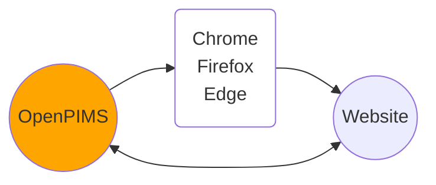
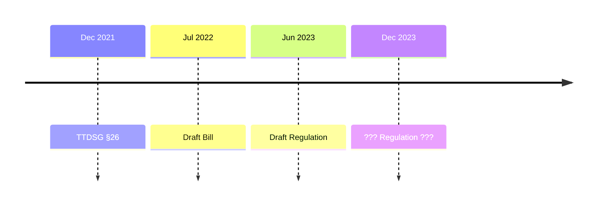
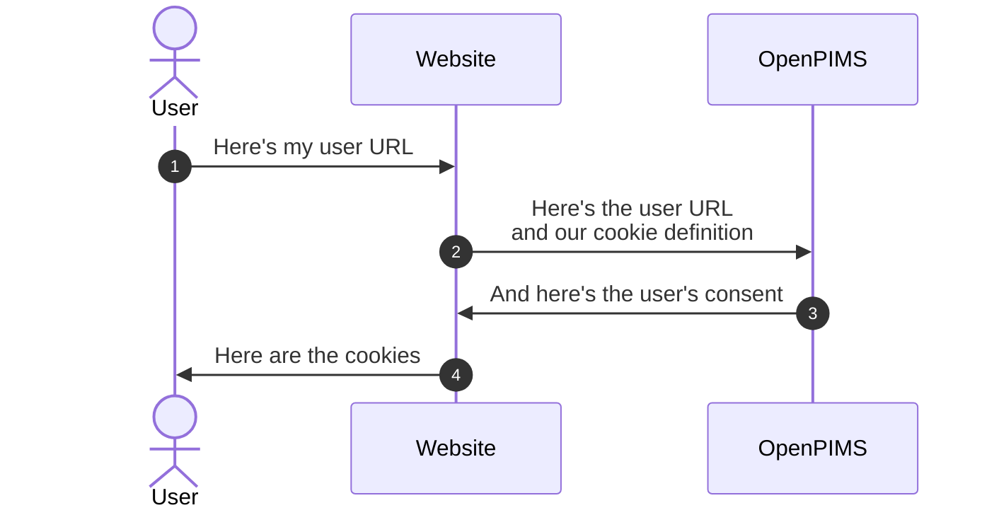

# OpenPIMS

OpenPIMS 2.0 is an open-source reference implementation for the German Telecommunications-Digital-Services-Data-Protection-Act (TDDDG) that makes cookie banners obsolete and strengthens digital self-determination.

The system includes a central infrastructure with browser extensions for Chrome, Firefox, Edge, and Safari, as well as integrations for Cloudflare Worker and WordPress.

## Timeline

## Category Definition on Operator Side:
JSON array with the following parameters

- Category (String)
- Text (String)
- Mapping (String, optional)
- Vendors (Array optional)

The Vendors array has the following structure
- Vendor (String)
- Url (URL-String)

### OpenAPI-Style Identifier Arrays

Cookie definitions now support OpenAPI-style identifier arrays in the description language (see [cookie-api-schema.yaml](cookie-api-schema.yaml)):

Supported identifier types:
- `purpose`: Purpose of the cookie
- `provider`: Provider/Service provider
- `retention`: Retention period
- `data_stored`: Data stored
- `revocation_info`: Revocation information

## Workflow

## Security Architecture

### Deterministic Token System
OpenPIMS 2.0 uses a deterministic token system for secure authentication without direct transmission of user credentials:

- **Token Generation**: `hash_hmac('sha256', userId + requestingDomain + dayTimestamp, user.token).substr(0, 32)`
- **Day-based Rotation**: Tokens are valid for the current day and previous day (24-hour grace period)
- **User Identification**: The server iterates through all users to find the matching token
- **Security**: Each user has a unique master token (`user.token`) that serves as the HMAC secret
- **Format**: `{userId}{requestingDomain}{dayTimestamp}` where dayTimestamp = `floor(time() / 86400)`

### Subdomain-based Routing
The system uses three different subdomains:
- **Main Domain** (`APP_DOMAIN`): User interface, authentication, site management
- **`me.` Subdomain**: HTTP Basic Auth endpoint for user credentials
- **Token Subdomain** (`{token}.APP_DOMAIN`): API endpoints for cookie consent queries

## Funding
This project is funded by the Federal Ministry for Research, Technology and Space.

