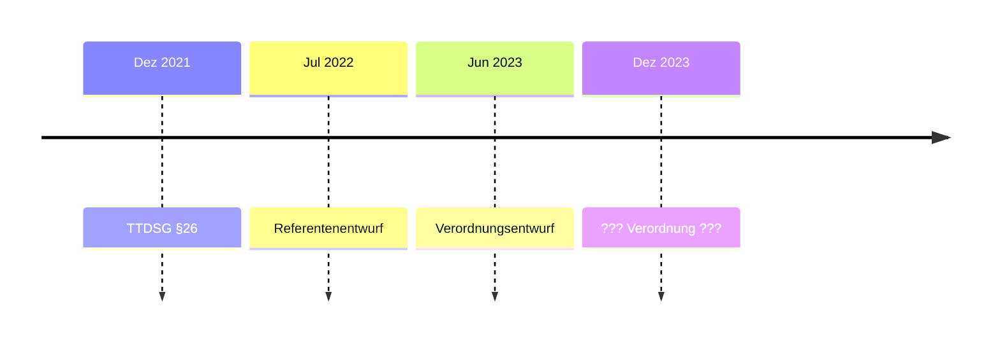
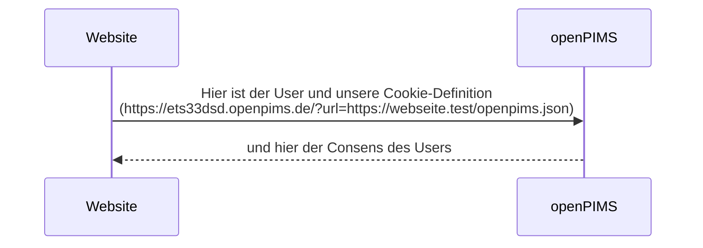

# openPIMS

openPIMS ist ein Entwurf für ein Personal Information Management System auf openSource-Basis.

Es besteht aus einem zentralen Server und aktuell einem Browser-Plugin für Chrome.

```mermaid
  graph LR;
      A((openPIMS)) --> Chrome;
      Chrome<br>Firefox<br>Edge --> Webseite;
      Webseite <--> A;
```

## Timeline


## Category-Definition auf Betreiber-Seite:
Json-Array mit folgenden Parametern

- Category (String)
- Text (String)
- Mapping (String, optional)
- Vendors (Array optional)

Das Vendors-Array hat folgende Struktur
- Vendor (String)
- Url (URL-String)

#### Beispiel (openpims.json)

    [
        {
            "category": "necessary",
            "text": "Unbedingt erforderliche Cookies",
            "mapping": "necessary",
            "vendors": []
        },
        {
            "category": "marketing",
            "text": "Cookies für Marketingzwecke",
            "mapping": "marketing",
            "vendors": [
                {
                    "vendor": "Datawrapper GmbH",
                    "url" : "https://www.datawrapper.de/privacy"
                },
                {
                    "vendor": "Facebook Video",
                    "url" : "https://www.facebook.com/privacy"
                }
            ]
        },
        {
            "category": "test",
            "text": "Test-Cookies"
        }
    ]

## Workflow


## Förderung
Das Projekt ist durch das das Bundesministerium für Bildung und Forschung (BMBF) gefördert .


