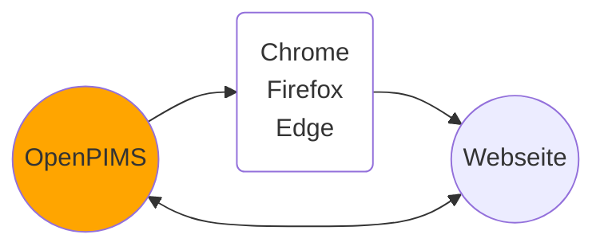
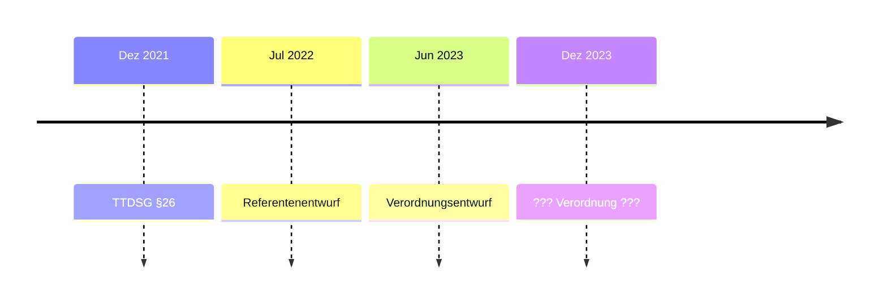
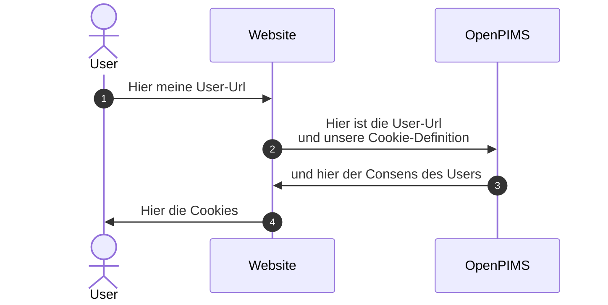

# OpenPIMS

OpenPIMS 2.0 ist eine Open-Source-Referenzimplementierung für das Telekommunikation-Digitale-Dienste-Datenschutz-Gesetz (TDDDG), die Cookie-Banner überflüssig macht und die digitale Selbstbestimmung stärkt.

Das System umfasst eine zentrale Infrastruktur mit Browser-Erweiterungen für Chrome, Firefox, Edge und Safari sowie Integrationen für Cloudflare Worker und WordPress.



## Timeline


## Category-Definition auf Betreiber-Seite:
Json-Array mit folgenden Parametern

- Category (String)
- Text (String)
- Mapping (String, optional)
- Vendors (Array optional)

Das Vendors-Array hat folgende Struktur
- Vendor (String)
- Url (URL-String)

### OpenAPI-Style Identifier Arrays

Die Cookie-Definitionen unterstützen jetzt OpenAPI-style Identifier-Arrays in der Beschreibungs-Sprache:

```yaml
identifiers:
  type: array
  items:
    $ref: '#/components/schemas/Identifier'

Identifier:
  type: object
  properties:
    identifier:
      type: string
    value:
      type: string
      nullable: true
```

Unterstützte Identifier-Typen:
- `purpose`: Zweck des Cookies
- `provider`: Anbieter/Dienstleister
- `retention`: Aufbewahrungsdauer
- `data_stored`: Gespeicherte Daten
- `revocation_info`: Widerrufs-Informationen


## Workflow


## Förderung
Das Projekt ist durch das Bundesministerium für Forschung, Technologie und Raumfahrt gefördert.


