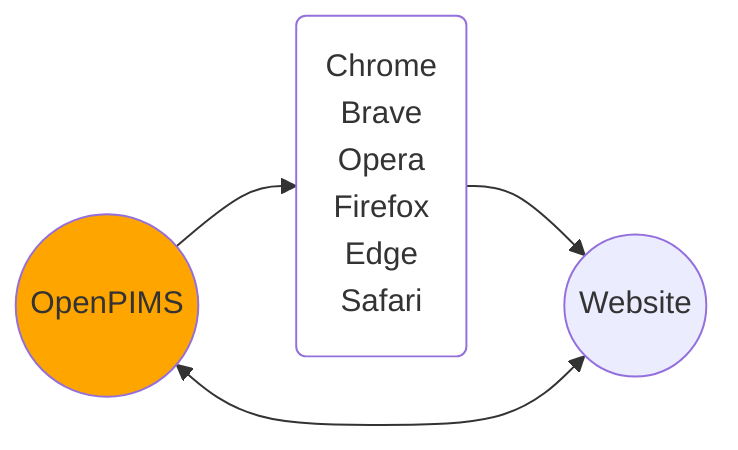
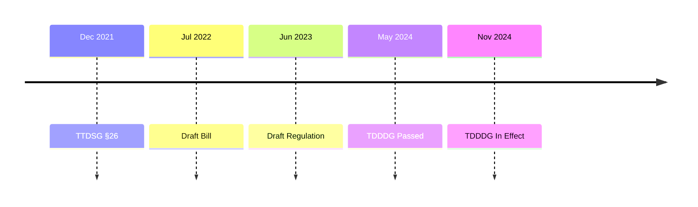
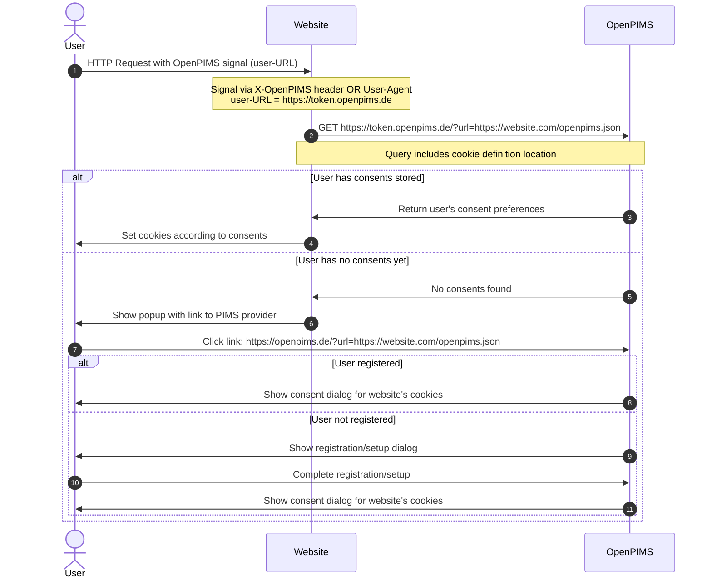

# OpenPIMS

OpenPIMS 2.0 is an open-source reference implementation for the German Telecommunications-Digital-Services-Data-Protection-Act (TDDDG) that provides a centralized consent management system for web cookies and strengthens digital self-determination.

The system includes a central infrastructure with browser extensions for Chrome, Brave, Opera, Firefox, Edge, and Safari, as well as integrations for Cloudflare Worker, WordPress, and mitmproxy.



## Timeline


## Category Definition on Operator Side:
JSON array with the following parameters

- Category (String)
- Text (String)
- Mapping (String, optional)
- Vendors (Array optional)

The Vendors array has the following structure
- Vendor (String)
- Url (URL-String)

## Browser Extensions

**⚠️ IMPORTANT: New Unified Extension Available**

The OpenPIMS browser extensions have been migrated to a modern, unified codebase:

**Repository:** `../extensions/` (WXT Framework, TypeScript)

**Features:**
- ✅ **One Codebase** for all browsers: Chrome, Brave, Opera, Firefox, Edge, Safari
- ✅ **Modern Stack**: TypeScript, Vite, Hot Module Reload
- ✅ **50% Smaller**: Web Crypto API instead of external libraries
- ✅ **DSGVO-Compliant**: User-Agent only, no cookies or custom headers
- ✅ **Daily Rotation**: Automatic via Chrome Alarms API

**Quick Start:**
```bash
cd ../extensions/
npm install
npm run dev        # Development (all browsers)
npm run build      # Production build
```

See `../extensions/README.md` for complete documentation.

**Legacy Extensions (Deprecated):**
- `../chromium/` - Chrome/Edge/Brave/Opera extension ⚠️ Use unified extension
- `../firefox/` - Firefox extension ⚠️ Use unified extension
- `../safari/` - Safari extension ⚠️ Use unified extension

---

## API Definitions

### 1. Cookie Definition File (Website Side)

Each participating website provides a cookie definition file that describes all cookies used:

**Location:**
- **Default**: `https://example.com/openpims.json` (root of website)
- **Custom**: Website can specify any URL for the definition file

**Format:** JSON file following schema defined in [openpims.yaml](openpims.yaml)

**Structure:**
```json
{
  "site": "Website Name",
  "cookies": [
    {
      "cookie": "cookie_name",
      "necessary": true,
      "category": "functional",
      "providers": "Provider name(s)",
      "data_stored": "Data description",
      "purposes": "Purpose(s) of the cookie",
      "retention_periods": "Retention period(s)",
      "revocation_info": "How to revoke consent"
    }
  ]
}
```

**Required fields:**
- `site`: Name of the website/service
- `cookies`: Array of cookie objects
  - `cookie`: Cookie name (required)
  - `necessary`: Boolean - technically necessary or optional (required)
  - `category`: Cookie category - **functional, personalization, analytics, marketing** (optional, default: functional)
  - `providers`: Provider(s) or service provider(s) - used for Provider-Level consent
  - `data_stored`: What data is stored
  - `purposes`: Purpose(s) of the cookie
  - `retention_periods`: Retention period(s)
  - `revocation_info`: How to revoke consent or delete cookie

### 2. Consent Query API

Websites query user consents using the domain-specific user-URL from the browser extension.

The extension transmits the user-URL via User-Agent header:
- **User-Agent Format:** `Mozilla/5.0... OpenPIMS/2.0 ({url})`
  - Not configured: `OpenPIMS/2.0 ()`
  - First request: `OpenPIMS/2.0 (https://openpims.de)`
  - Domain-specific: `OpenPIMS/2.0 (https://{token}.openpims.de)`

**Legacy (Deprecated):**
- `X-OpenPIMS` header - Only used in old extensions

**Endpoint Pattern:**
```
https://{domain-specific-token}.{pims-domain}/?url={cookie-definition-file-location}
```

**Example:**
```
https://a1b2c3d4e5f6g7h8i9j0k1l2m3n4o5p6.openpims.de/?url=https://example.com/openpims.json
```

**Parameters:**
- `url`: Location of the cookie definition file (can be default `/openpims.json` or custom URL)

**Response Format:** JSON array following schema defined in [api.yaml](api.yaml)

**Response Structure:**
```json
[
  {
    "cookie": "session_id",
    "allowed": true
  },
  {
    "cookie": "analytics_tracking",
    "allowed": false
  },
  {
    "cookie": "preferences",
    "allowed": true
  }
]
```

**Response fields:**
- `cookie`: Cookie name (string)
- `allowed`: Consent status - true = accepted, false = rejected (boolean)

## 3-Tier Consent Model

OpenPIMS 2.0 implements a hierarchical consent system that allows users to manage cookie preferences at three different granularity levels:

### Tier 1: Category-Level (📊 Einfach)
**Basic consent management** - Users accept or reject entire cookie categories.

- **Use Case**: User wants simple, quick consent decisions
- **Example**: "Accept all analytics cookies" or "Reject all marketing cookies"
- **Categories**: **functional, personalization, analytics, marketing**
  - Compatible with [Open Cookie Database](https://github.com/jkwakman/Open-Cookie-Database)
  - Compatible with [EDPB Website Auditing Tool](https://www.edpb.europa.eu/our-work-tools/our-documents/support-pool-experts-projects/edpb-website-auditing-tool_en)
- **TDDDG Compliance**: Meets minimum requirements per TDDDG §25

### Tier 2: Provider-Level (🏢 Erweitert)
**Advanced consent management** - Users accept or reject specific providers within categories.

- **Use Case**: User trusts some providers but not others in the same category
- **Example**: "Accept Matomo analytics but reject Google Analytics"
- **Provider Normalization**: Automatic mapping of variations (e.g., "google analytics" → "Google Analytics")
- **Granularity**: More control than categories, less than individual cookies

### Tier 3: Cookie-Level (🔬 Experte)
**Expert consent management** - Users accept or reject individual cookies.

- **Use Case**: User wants maximum control over specific cookies
- **Example**: "Accept _ga but reject _gid (both Google Analytics)"
- **Granularity**: Highest level of control, cookie-by-cookie decisions
- **Override**: Cookie-level consent overrides category and provider settings

### Consent Resolution Priority

OpenPIMS resolves cookie consent using this priority system:

```
1. Cookie-Level (Tier 3) ← Highest Priority
   ↓ (if not set)
2. Provider-Level (Tier 2)
   ↓ (if not set)
3. Category-Level (Tier 1)
   ↓ (if not set)
4. Default
   - necessary=true → allow (TDDDG §25 Abs. 2)
   - necessary=false → reject
```

**Example Resolution:**
```
User Settings:
- Category "analytics": REJECT
- Provider "Matomo": ACCEPT
- Cookie "_ga": ACCEPT

Results:
- _ga (Google Analytics): ACCEPT ← Cookie-Level overrides
- _gid (Google Analytics): REJECT ← Category-Level applies
- _pk_id (Matomo): ACCEPT ← Provider-Level overrides Category
- _pk_ses (Matomo): ACCEPT ← Provider-Level overrides Category
```

### User Interface

The consent UI uses Bootstrap Tabs:

- **📊 Einfach** (Simple): Category view with toggle switches
- **🏢 Erweitert** (Advanced): Provider view grouped by categories
- **🔬 Experte** (Expert): Complete cookie list table

Users can switch between modes freely. Each mode saves its tier-specific consents, and the API resolution combines all tiers during consent queries.

### Implementation Details

**Database Schema:**
- `consent_categories` - Stores category-level consents (Tier 1)
- `consent_providers` - Stores provider-level consents (Tier 2)
- `consents` - Stores cookie-level consents (Tier 3)

**API Resolution** (`ApiController::index()`):
- Fetches all three tiers for user/site combination
- Applies priority logic to determine final consent status
- Returns resolved cookie list to website

**Provider Normalization** (`ConsentProvider::normalizeProvider()`):
- Maps common variations to canonical names
- Ensures consistent provider matching
- Example mappings:
  - "google analytics" → "Google Analytics"
  - "facebook pixel" → "Meta Platforms (Facebook)"
  - "twitter inc." → "Twitter (X Corp.)"

## Workflow

### For Users with OpenPIMS Extension


## User Onboarding

OpenPIMS features an optimized 4-step onboarding flow with automatic detection:

### Step 1: Account Creation
- Passwordless authentication via magic link
- Automatic account creation and verification

### Step 2: Extension Installation
- **Browser Detection**: Automatically detects user's browser (Chrome, Firefox, Edge, Safari)
- Shows only the relevant extension with other browsers hidden under "More Extensions"
- **Auto-Detection**: Polls every 2 seconds to detect when extension is installed
- No manual page reload required

### Step 3: Extension Synchronization
- **Automatic Setup**: One-click sync button in extension popup
- **Auto-Detection**: Polls every 2 seconds to detect when extension is synchronized
- Manual setup option available (collapsed by default)
- No manual page reload required

### Step 4: Reward & Aha-Moment
- Celebration screen shown once after successful setup
- Direct CTAs to test sites (YouTube, Spiegel.de) to experience cookie-free browsing
- Session-based tracking (resets when user logs out)

### Technical Implementation
- Extension detection via two methods:
  - **Method 1: X-OpenPIMS Header** (Chrome, Firefox, Chromium):
    - `not-configured`: Extension installed but not logged in
    - `https://{token}.{domain}`: Extension installed and synchronized
  - **Method 2: User-Agent Signal** (Safari):
    - Pattern: `OpenPIMS/1.0 (+{url})`
    - Example: `Mozilla/5.0 (...) Safari/605.1.15 OpenPIMS/1.0 (+https://token.domain.de)`
    - Used when platform doesn't support header modification
- JavaScript polling via `/api/extension-check` endpoint
- Automatic page reload when state changes detected
- Tab-based UI with only active/next step enabled

## Security Architecture

### Deterministic Token System
OpenPIMS 2.0 uses a deterministic token system for secure authentication without direct transmission of user credentials:

- **Token Generation**: `hash_hmac('sha256', userId + requestingDomain + dayTimestamp, user.token).substr(0, 32)`
- **Day-based Rotation**: Tokens are valid for the current day and previous day (24-hour grace period)
- **User Identification**: The server iterates through all users to find the matching token
- **Security**: Each user has a unique master token (`user.token`) that serves as the HMAC secret
- **Format**: `{userId}{requestingDomain}{dayTimestamp}` where dayTimestamp = `floor(time() / 86400)`

### Subdomain-based Routing
The system uses two different subdomain types:
- **Main Domain** (`APP_DOMAIN`): User interface, authentication, site management, extension setup API
- **Token Subdomain** (`{token}.APP_DOMAIN`): API endpoints for cookie consent queries

## Funding
This project is funded by the Federal Ministry for Research, Technology and Space.


