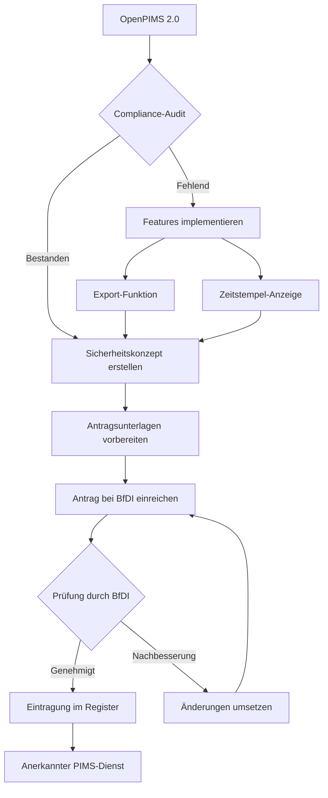

# EinwV-Compliance-Analyse für OpenPIMS 2.0

**Datum:** 23. Oktober 2025
**Version:** OpenPIMS 2.0
**Rechtsgrundlage:** Einwilligungsverwaltungs-Verordnung (EinwV) vom 1. April 2025
**Quelle:** https://www.gesetze-im-internet.de/einwv/BJNR0200B0025.html

---

## Executive Summary

Die Einwilligungsverwaltungs-Verordnung (EinwV) ist am **1. April 2025** in Kraft getreten und regelt die Anerkennung von **Einwilligungsverwaltungsdiensten (PIMS)** nach § 26 TDDDG.

**Status OpenPIMS 2.0:**
- ✅ **Grundkonzept konform:** 3-Tier-Consent-System, Open Source, neutraler Dienst
- ⚠️ **Zertifizierung erforderlich:** Anerkennung durch BfDI (Bundesbeauftragte für Datenschutz) notwendig
- 🔧 **Nachbesserungsbedarf:** Sicherheitskonzept, Portabilität, formale Dokumentation

---

## Teil 1: Anwendungsbereich und Definitionen

### § 1 - Anwendungsbereich

**Gesetzestext:**
> Die Verordnung regelt: (1) Anwendungsbereich und Definitionen; (2) Anforderungen an die Anerkennung; (3) Anerkennungsverfahren durch unabhängige Behörde; (4) technisch-organisatorische Maßnahmen für Diensteanbieter und Softwarehersteller.

**OpenPIMS Status:** ✅ **ERFÜLLT**

OpenPIMS ist ein Einwilligungsverwaltungsdienst im Sinne der EinwV:
- IT-Anwendung zur Verwaltung von Nutzereinstellungen
- Speicherung, Übermittlung und Widerruf von Einwilligungen
- Integration mit Telemedienangeboten via Browser-Extension und API

**Hinweis:** Die Verordnung stellt klar, dass die **DSGVO-Compliance-Verantwortung beim Website-Betreiber** bleibt, nicht beim PIMS-Anbieter.

---

### § 2 - Begriffsbestimmungen

**Relevante Definitionen für OpenPIMS:**

| Begriff | Definition EinwV | OpenPIMS-Umsetzung |
|---------|------------------|-------------------|
| **Einwilligungsverwaltungsdienst** | IT-Anwendung zur Verwaltung von Nutzereinstellungen | ✅ Laravel-Backend + Browser-Extensions |
| **Anerkannter Dienst** | Durch zuständige Stelle zertifizierter Dienst | ⚠️ **Noch nicht zertifiziert** |
| **Abruf-/Darstellungssoftware** | Programme zum Zugriff auf Internet-Inhalte | ✅ Browser-Extensions (Chrome, Firefox, Edge, Safari) |
| **Nutzereinstellungen** | Entscheidungen zu Einwilligungen nach § 25 Abs. 1 TDDDG | ✅ 3-Tier-System (Category, Provider, Cookie) |

---

## Teil 2: Anforderungen an anerkannte Dienste

### § 3 - Allgemeine Anforderungen

**Gesetzestext:**
> Dienste müssen: Nutzereinstellungen bei Erstnutzung speichern; nur Einwilligungen verwalten, bei denen Nutzer zuvor über (1) Anbieter/Dritte, (2) gespeicherte Informationen, (3) Zwecke, (4) Speicherdauer, (5) Widerrufsrechte informiert wurden.

**OpenPIMS Status:** ✅ **WEITGEHEND ERFÜLLT**

#### ✅ Was OpenPIMS bereits leistet:

1. **Speicherung bei Erstnutzung:**
   - Onboarding-Flow mit 4 Schritten (Account → Extension → Sync → Reward)
   - Einstellungen werden in `consent_categories`, `consent_providers`, `consents` Tabellen gespeichert
   - Persistenz über deterministische Token-System

2. **Informationspflichten (Art. 7, 12-14 DSGVO):**
   - Cookie-Definitionen via `openpims.json` enthalten:
     - `site` (Anbieter)
     - `providers` (Dritte)
     - `data_stored` (gespeicherte Informationen)
     - `purposes` (Zwecke)
     - `retention_periods` (Speicherdauer)
     - `revocation_info` (Widerrufsrechte)

3. **Dokumentation der Grundlageninformationen:**
   - Cookie-Definitionen werden in `cookies` Tabelle gespeichert
   - Verknüpfung mit Consents über `cookie_id`

#### ⚠️ Was fehlt:

- **Zeitstempel bei Einwilligung:** `consents` Tabelle hat `created_at`, aber **Anzeige für Nutzer fehlt**
- **Dokumentation der ursprünglichen Information:** Keine Versionierung der Cookie-Definitionen (wenn Website `openpims.json` ändert, ist alte Version weg)

**Handlungsempfehlung:**
```sql
-- Migration: Consent-Zeitstempel für Nutzer sichtbar machen
ALTER TABLE consents ADD COLUMN consent_given_at TIMESTAMP NULL;
ALTER TABLE consent_categories ADD COLUMN consent_given_at TIMESTAMP NULL;
ALTER TABLE consent_providers ADD COLUMN consent_given_at TIMESTAMP NULL;

-- Neue Tabelle: Cookie-Definition-Versionierung
CREATE TABLE cookie_definition_snapshots (
    snapshot_id INT PRIMARY KEY,
    site_id INT,
    cookie_id INT,
    definition_json TEXT, -- Vollständige Cookie-Definition zum Zeitpunkt der Einwilligung
    created_at TIMESTAMP
);
```

---

### § 4 - Nutzerfreundliche Verfahren

**Gesetzestext:**
> Schnittstellen müssen transparent/verständlich für informierte Entscheidungen sein. Nutzer können Einstellungen (inkl. Zeitstempel) jederzeit ansehen und ändern/widerrufen. Aufforderung zur Überprüfung nur alle 12 Monate. Export in gängigen Formaten ermöglichen.

**OpenPIMS Status:** ⚠️ **TEILWEISE ERFÜLLT**

#### ✅ Was OpenPIMS bereits leistet:

1. **Transparente Schnittstelle:**
   - Bootstrap-basierte UI mit 3 Tabs (Einfach/Erweitert/Experte)
   - 3-Tier-System: Category → Provider → Cookie-Level
   - Deutsche Beschreibungen in `ConsentCategory::CATEGORIES`

2. **Jederzeit Änderung möglich:**
   - Dashboard unter `/` zeigt alle Sites
   - Edit-Modal ermöglicht Änderung aller Einstellungen
   - `POST /consent/category/save`, `/consent/provider/save`, `/consent/mixed/save`

3. **Widerrufsmöglichkeit:**
   - Toggle-Switches in UI
   - `checked` = null/0/1 (nicht gesetzt/abgelehnt/akzeptiert)

#### ❌ Was fehlt:

1. **Zeitstempel-Anzeige für Nutzer:**
   - `created_at` existiert in DB, wird aber **nicht in UI angezeigt**
   - Gesetz fordert explizit: "einschließlich Zeitangaben"

2. **Jährliche Review-Aufforderung:**
   - Keine Erinnerung nach 12 Monaten implementiert
   - **Optional:** Nutzer sollen selbst entscheiden können

3. **Export-Funktion:**
   - Keine Export-Funktion für Nutzereinstellungen
   - Gesetz fordert: "in gängigen Formaten" (JSON, CSV)

**Handlungsempfehlung:**

```php
// HomeController.php - Export-Funktion hinzufügen
public function exportConsents() {
    $user = Auth::user();

    $data = [
        'user' => $user->email,
        'exported_at' => now()->toIso8601String(),
        'consents' => [
            'categories' => $user->consentCategories()->with('site')->get(),
            'providers' => $user->consentProviders()->with('site')->get(),
            'cookies' => $user->consents()->with('cookie.site')->get(),
        ]
    ];

    return response()->json($data)
        ->header('Content-Disposition', 'attachment; filename="openpims-consents.json"');
}

// Route hinzufügen
Route::get('/export-consents', [HomeController::class, 'exportConsents']);
```

```blade
<!-- home.blade.php - Zeitstempel anzeigen -->
<small class="text-muted">
    Zuletzt geändert: {{ $consent->updated_at->format('d.m.Y H:i') }} Uhr
</small>
```

---

### § 5 - Dienstewechselrecht

**Gesetzestext:**
> Nutzer können jederzeit zu anderem anerkannten Dienst wechseln und Einstellungen übertragen. Dienste müssen Einstellungen in maschinenlesbarem Format vorhalten und kostenfrei bereitstellen.

**OpenPIMS Status:** ❌ **NICHT ERFÜLLT**

#### Was fehlt:

1. **Import-Funktion:** Keine Möglichkeit, Consents von anderen PIMS zu importieren
2. **Export-Format-Standard:** Kein einheitliches Format definiert (könnte JSON sein)
3. **Portabilität:** Nutzer kann nicht einfach zu anderem PIMS wechseln

**Handlungsempfehlung:**

Da OpenPIMS aktuell der **einzige Open-Source-PIMS** ist, ist dies mittelfristig weniger relevant. Sobald weitere PIMS existieren, sollte ein **PIMS-Interchange-Format** definiert werden:

```json
{
  "format": "PIMS-Interchange-v1",
  "exported_at": "2025-10-23T12:34:56Z",
  "user_id": "hash_or_email",
  "consents": [
    {
      "site": "example.com",
      "site_url": "https://example.com/openpims.json",
      "category_consents": {
        "functional": true,
        "analytics": false,
        "marketing": false,
        "personalization": true
      },
      "provider_consents": {
        "analytics": {
          "Google Analytics": false,
          "Matomo": true
        }
      },
      "cookie_consents": {
        "_ga": false,
        "_gid": false
      },
      "consent_given_at": "2025-09-15T10:20:30Z"
    }
  ]
}
```

---

### § 6 - Wettbewerbsanforderungen

**Gesetzestext:**
> Verfahren müssen sicherstellen: (1) alle Diensteanbieter erhalten gleichberechtigten Echtzeit-Zugriff auf Consent-Anfragen; (2) keine diskriminierende Übermittlungsverweigerung; (3) einheitliche Anbieterauflistung (alphabetisch/chronologisch) mit uniformer Informationsdarstellung.

**OpenPIMS Status:** ✅ **ERFÜLLT**

#### ✅ Was OpenPIMS bereits leistet:

1. **Gleichberechtigter Zugriff:**
   - API ist offen für alle Websites über `{token}.openpims.de`
   - Keine Whitelist oder Blacklist (außer optionale `RESTRICTED_DOMAIN`)
   - Echtzeit-Abfrage via `ApiController::index()`

2. **Keine Diskriminierung:**
   - Open-Source-Lizenz ermöglicht allen Nutzung
   - Keine bevorzugte Behandlung einzelner Websites
   - Deterministische Tokens für alle Nutzer gleich

3. **Einheitliche Darstellung:**
   - Cookie-Definitionen werden alphabetisch nach Kategorie sortiert
   - Alle Cookies werden einheitlich in Bootstrap-Tables dargestellt
   - Provider-Normalisierung in `ConsentProvider::normalizeProvider()`

**Hinweis:** Der RESTRICTED_DOMAIN-Mode verstößt **nicht** gegen § 6, da er nur für **interne/geschlossene Deployments** gedacht ist (z.B. Unternehmens-PIMS). Öffentliche OpenPIMS-Instanzen sollten `RESTRICTED_DOMAIN=null` haben.

---

### § 7 - Interoperabilitätstechnologien

**Gesetzestext:**
> Dienste müssen Technologien verwenden, die ermöglichen: (1) Erkennung, dass Nutzer zertifizierten Dienst verwenden; (2) Empfang von Consent-Anfragen von Diensteanbietern; (3) Prüfung, ob Nutzereinstellungen existieren.

**OpenPIMS Status:** ✅ **ERFÜLLT**

#### ✅ Was OpenPIMS bereits leistet:

1. **Erkennung durch Websites:**
   - **User-Agent-Signal:** `Mozilla/5.0 (...) OpenPIMS/2.0 (https://{token}.openpims.de)`
   - Websites erkennen OpenPIMS-Nutzer automatisch
   - Kompatibel mit allen Browsern (Chrome, Firefox, Edge, Safari)

2. **Empfang von Consent-Anfragen:**
   - Websites können `openpims.json` bereitstellen
   - OpenPIMS fetcht diese automatisch über cURL
   - HomeController.php:214-339 (Cookie-Import-Logic)

3. **Prüfung von Nutzereinstellungen:**
   - API-Endpoint: `GET https://{token}.openpims.de/?url=https://example.com/openpims.json`
   - Rückgabe: JSON mit Consent-Status für alle Cookies
   - ApiController.php:67-146 (Consent-Resolution-Logic)

**Technologie:**
- User-Agent-Modifikation via Browser Extension (declarativeNetRequest API)
- HTTP-basierte API (RESTful)
- JSON-Format für Cookie-Definitionen und Consents

---

## Teil 3: Anerkennungsverfahren

### § 8 - Zuständige Stelle

**Gesetztext:**
> Bundesbeauftragte für Datenschutz und Informationsfreiheit (BfDI) verwaltet Anerkennung.

**OpenPIMS Status:** ⚠️ **AKTION ERFORDERLICH**

**Zuständige Behörde:**
- **Name:** Die Bundesbeauftragte für den Datenschutz und die Informationsfreiheit (BfDI)
- **Adresse:** Graurheindorfer Str. 153, 53117 Bonn
- **Website:** https://www.bfdi.bund.de/
- **E-Mail:** poststelle@bfdi.bund.de

**Nächster Schritt:**
1. Antrag bei BfDI einreichen (§ 11 EinwV)
2. Sicherheitskonzept gemäß § 12 vorlegen
3. Nachweis der wirtschaftlichen Unabhängigkeit
4. Eintragung in öffentliches Register (§ 13)

---

### § 9 - Informationsaustausch

**Gesetzestext:**
> Behörden informieren Landesaufsichtsbehörden über Anerkennungen und tauschen Informationen über Wirksamkeitsprobleme aus.

**OpenPIMS Status:** ℹ️ **AUTOMATISCH NACH ZERTIFIZIERUNG**

Sobald OpenPIMS zertifiziert ist, wird BfDI automatisch die Landesdatenschutzbehörden informieren.

---

### § 10 - Anerkennungsvoraussetzungen

**Gesetzestext:**
> Dienste müssen Teil 2-Anforderungen erfüllen und Sicherheitskonzept nach § 12 vorlegen.

**OpenPIMS Status:** ⚠️ **IN ARBEIT**

**Checkliste:**
- ✅ § 3 - Allgemeine Anforderungen (weitgehend erfüllt)
- ⚠️ § 4 - Nutzerfreundliche Verfahren (Export fehlt)
- ❌ § 5 - Dienstewechselrecht (Import/Export fehlt)
- ✅ § 6 - Wettbewerbsanforderungen (erfüllt)
- ✅ § 7 - Interoperabilitätstechnologien (erfüllt)
- ❌ § 12 - Sicherheitskonzept (muss erstellt werden)

---

### § 11 - Antragsanforderungen

**Gesetzestext:**
> Anträge müssen elektronisch mit dokumentierter Dienstbeschreibung eingereicht werden. Antragsteller müssen angeben: Rechtsstatus/Registrierung; EU-Adresse; Kommunikationskanäle; wirtschaftliche/organisatorische Struktur; Finanzierung; Nachweis der Unabhängigkeit von interessierten Parteien.

**OpenPIMS Status:** ⚠️ **VORBEREITUNG ERFORDERLICH**

**Benötigte Unterlagen für Antrag:**

1. **Dienstbeschreibung:**
   - Technische Architektur (Laravel-Backend, Browser-Extensions, API)
   - 3-Tier-Consent-System (Category, Provider, Cookie)
   - Deterministische Token-Generierung
   - User-Agent-Signal-Technologie

2. **Antragsteller-Informationen:**
   - Rechtsstatus: Einzelperson/Unternehmen/Verein?
   - Handelsregister-Nummer (falls vorhanden)
   - EU-Adresse
   - Kommunikationskanäle (E-Mail, Telefon, Website)

3. **Wirtschaftliche/Organisatorische Struktur:**
   - Finanzierungsmodell (Open Source, Community-finanziert, kommerziell?)
   - Organisationsstruktur (Solo-Entwickler, Team, Foundation?)
   - **Nachweis der Unabhängigkeit:** Keine finanzielle Abhängigkeit von Cookie-Anbietern, Tracking-Unternehmen oder Werbefirmen

4. **Sicherheitskonzept (§ 12):**
   - Siehe nächster Abschnitt

5. **Auftragsverarbeiter-Informationen:**
   - Hosting-Provider (z.B. Hetzner, AWS, etc.)
   - Datenbank-Hosting
   - E-Mail-Provider (Mailgun)
   - Stripe (Payment Processing) - falls relevant

**Hinweis:** Als **Open-Source-Projekt** hat OpenPIMS einen Vorteil beim **Nachweis der Unabhängigkeit**, da der Code öffentlich einsehbar ist.

---

### § 12 - Sicherheitskonzept

**Gesetzestext:**
> Konzepte müssen adressieren: (1) Sicherheit personenbezogener Daten/Einstellungen; (2) Datenspeicherort; (3) technische Maßnahmen zur Beschränkung auf Consent-Management-Funktionen; (4) Zugriffsschutz und Verfügbarkeitssicherung; (5) Risikominderung für Integrität/Vertraulichkeit/Verfügbarkeit.

**OpenPIMS Status:** ❌ **MUSS ERSTELLT WERDEN**

**Checkliste für Sicherheitskonzept:**

#### 1. Sicherheit personenbezogener Daten

**Zu dokumentieren:**

```markdown
## 1. Datenschutz und Datensicherheit

### 1.1 Personenbezogene Daten in OpenPIMS

| Datenart | Zweck | Rechtsgrundlage |
|----------|-------|-----------------|
| E-Mail-Adresse | Nutzer-Identifikation, Magic Link | Art. 6 Abs. 1 lit. b DSGVO (Vertragserfüllung) |
| User-Token (HMAC Secret) | Deterministische Token-Generierung | Art. 6 Abs. 1 lit. b DSGVO |
| Consent-Einstellungen | Einwilligungsverwaltung | Art. 6 Abs. 1 lit. b DSGVO |
| Stripe Customer ID | Payment (falls kommerziell) | Art. 6 Abs. 1 lit. b DSGVO |
| Visit-Timestamps | Aktivitätstracking | Art. 6 Abs. 1 lit. f DSGVO (berechtigtes Interesse) |

### 1.2 Sicherheitsmaßnahmen

- **Verschlüsselung:**
  - HTTPS für alle Verbindungen (TLS 1.3)
  - Datenbank-Verschlüsselung at-rest (MySQL AES)
  - HMAC-SHA256 für Token-Generierung

- **Zugriffskontrolle:**
  - Laravel Sanctum für API-Authentifizierung
  - Session-basierte Web-Auth
  - Magic Link (120 Min. Gültigkeit)

- **Datensparsamkeit:**
  - Keine Passwort-Speicherung (Passwordless Auth)
  - Keine IP-Adressen gespeichert
  - Keine Tracking-Cookies gesetzt
```

#### 2. Datenspeicherort

**Zu dokumentieren:**

```markdown
## 2. Datenspeicherung

### 2.1 Server-Standort
- Hosting-Provider: [z.B. Hetzner GmbH, Deutschland]
- Rechenzentrum-Standort: [z.B. Falkenstein, Deutschland - EU]
- Datenbank: MySQL 8.0, same server
- Backup-Standort: [z.B. Nürnberg, Deutschland - EU]

### 2.2 Drittanbieter (Auftragsverarbeiter)
- **Mailgun:** E-Mail-Versand (EU-Endpoint: api.eu.mailgun.net)
- **Stripe:** Payment Processing (falls kommerziell) - EU-Datenresidenz
- **Cloudflare:** DNS/DDoS-Protection (Turnstile: EU-Region)

### 2.3 Datenübermittlung außerhalb EU
**Status:** ❌ KEINE Datenübermittlung außerhalb EU/EWR
```

#### 3. Beschränkung auf Consent-Management

**Zu dokumentieren:**

```markdown
## 3. Zweckbindung - Nur Consent-Management

### 3.1 Funktionsumfang (Erlaubt)
- ✅ Speicherung von Consent-Einstellungen
- ✅ Übermittlung von Consents an Websites
- ✅ Widerruf von Consents
- ✅ Export von Nutzer-Einstellungen
- ✅ Magic Link Authentifizierung

### 3.2 NICHT implementierte Funktionen
- ❌ KEIN Tracking von Nutzerverhalten
- ❌ KEINE Analyse von Browsing-History
- ❌ KEIN Verkauf von Nutzerdaten
- ❌ KEINE Werbung oder Marketing
- ❌ KEINE Profilbildung über Consent-Zweck hinaus

### 3.3 Technische Sicherstellung
- Code-Review-Prozess (Open Source = öffentlich einsehbar)
- Keine Third-Party-Analytics (kein Google Analytics, kein Matomo)
- Minimale Dependencies (nur Laravel-Core + notwendige Packages)
```

#### 4. Zugriffsschutz und Verfügbarkeit

**Zu dokumentieren:**

```markdown
## 4. Zugriffsschutz

### 4.1 Physischer Zugriff
- Rechenzentrum: ISO 27001 zertifiziert
- 24/7 Überwachung
- Zutrittskontrolle via Biometrie

### 4.2 Logischer Zugriff
- **Datenbank:** Nur über localhost, keine Remote-Verbindungen
- **SSH:** Key-based Auth only, Password Auth disabled
- **Firewall:** UFW mit Whitelist (nur Port 80/443 öffentlich)
- **Fail2Ban:** Automatische IP-Sperre bei Brute-Force

### 4.3 Administrativer Zugriff
- Root-Zugriff: Nur benannte Personen
- 2FA für Admin-Accounts
- Audit-Logging aller Admin-Aktionen

### 4.4 Verfügbarkeit
- **Uptime-Ziel:** 99.5% (Downtime: max 3.6 Std/Monat)
- **Backup-Strategie:**
  - Tägliche DB-Backups (30 Tage Retention)
  - Wöchentliche Full-Backups (12 Wochen Retention)
  - Off-Site-Backup in separatem Rechenzentrum
- **Monitoring:**
  - Uptime-Monitoring (z.B. UptimeRobot)
  - Error-Logging (Laravel Log Viewer)
  - Alert-System bei Downtime
```

#### 5. Integrität, Vertraulichkeit, Verfügbarkeit

**Zu dokumentieren:**

```markdown
## 5. Schutz der CIA-Triade

### 5.1 Integrität (Integrity)
**Risiko:** Manipulation von Consent-Daten

**Maßnahmen:**
- HMAC-signierte Tokens (SHA256)
- Laravel CSRF-Protection
- Database Constraints (UNIQUE, FOREIGN KEY)
- Git-Versionierung mit Code-Signing
- Immutable Audit-Log für Consent-Änderungen

### 5.2 Vertraulichkeit (Confidentiality)
**Risiko:** Unbefugter Zugriff auf Consent-Daten

**Maßnahmen:**
- TLS 1.3 (HTTPS only, HSTS enabled)
- Database-Encryption at-rest
- Session-Encryption (Laravel Sanctum)
- Security Headers:
  - `Content-Security-Policy`
  - `X-Frame-Options: DENY`
  - `X-Content-Type-Options: nosniff`

### 5.3 Verfügbarkeit (Availability)
**Risiko:** DDoS-Angriffe, Server-Ausfall

**Maßnahmen:**
- Cloudflare DDoS-Protection
- Rate Limiting (60 Requests/Minute)
- Turnstile Bot-Protection
- Load Balancing (bei hohem Traffic)
- Disaster Recovery Plan (RTO: 4h, RPO: 24h)

### 5.4 Risikobewertung

| Risiko | Eintrittswahrscheinlichkeit | Schaden | Maßnahme |
|--------|----------------------------|---------|----------|
| Datenbank-Hack | Niedrig | Hoch | Encryption, Firewalling, Monitoring |
| DDoS-Angriff | Mittel | Mittel | Cloudflare, Rate Limiting |
| Server-Ausfall | Niedrig | Mittel | Backup, Monitoring, Redundanz |
| Code-Injection | Niedrig | Hoch | Laravel Security, Code Review |
| Phishing (Magic Link) | Mittel | Niedrig | 2h Expiry, User Education |
```

**Handlungsempfehlung:**

Erstelle ein separates Dokument `openpims/docs/Sicherheitskonzept-EinwV.md` mit den obigen Inhalten und füge spezifische Details deiner Infrastruktur hinzu.

---

### § 13 - Register

**Gesetzestext:**
> Zuständige Behörde führt öffentliches Register anerkannter Dienste.

**OpenPIMS Status:** ℹ️ **AUTOMATISCH NACH ZERTIFIZIERUNG**

Nach erfolgreicher Anerkennung wird OpenPIMS im **öffentlichen Register der BfDI** gelistet. Dies erhöht Vertrauen und Sichtbarkeit.

**Beispiel-Eintrag:**
```
Dienstname: OpenPIMS
Version: 2.0
Anbieter: [Name/Organisation]
Anerkannt seit: [Datum]
Status: Anerkannt
Website: https://openpims.de
```

---

### § 14 - Änderungsmitteilungen

**Gesetzestext:**
> Anbieter müssen jährlich Teil-2-Compliance bestätigen und Änderungen sofort melden.

**OpenPIMS Status:** ⚠️ **PROZESS DEFINIEREN**

**Erforderlicher Prozess nach Zertifizierung:**

1. **Jährliche Compliance-Prüfung:**
   - Termin: Jedes Jahr am Jahrestag der Anerkennung
   - Checkliste: § 3-7 durchgehen
   - Meldung an BfDI: "Hiermit bestätigen wir, dass OpenPIMS weiterhin alle Anforderungen erfüllt"

2. **Unverzügliche Änderungsmeldung bei:**
   - Änderung der Rechtsform (z.B. GmbH-Gründung)
   - Wechsel des Hosting-Providers
   - Neue Auftragsverarbeiter
   - Änderung der Geschäftsführung
   - Sicherheitsvorfälle
   - Wesentliche Code-Änderungen (Major-Releases)

**Empfehlung:**

Erstelle eine `CHANGELOG.md` mit Allen Änderungen und markiere "EinwV-relevante Änderungen":

```markdown
## [2.1.0] - 2025-11-15
### Changed
- **[EinwV-relevant]** Wechsel von Hetzner zu AWS (§ 14 EinwV)
- Minor UI improvements

## [2.0.0] - 2025-10-23
### Added
- 3-Tier Consent System
```

---

### § 15 - Beschwerdeverfahren

**Gesetzestext:**
> Dritte können elektronisch Verstöße gegen Teil-2-Anforderungen melden.

**OpenPIMS Status:** ℹ️ **AUTOMATISCH NACH ZERTIFIZIERUNG**

Nach Zertifizierung können Website-Betreiber oder Nutzer Beschwerden über OpenPIMS direkt an BfDI richten.

**Vorteil von Open Source:**
- Community kann Code-Audits durchführen
- Sicherheitslücken werden öffentlich gemeldet (Responsible Disclosure)
- Transparenz schafft Vertrauen

**Empfehlung:**

Ergänze im Repository:
- `SECURITY.md` mit Responsible Disclosure Policy
- `CODE_OF_CONDUCT.md` für Community-Standards
- Issue-Templates für Sicherheitsmeldungen

---

### § 16 - Widerruf der Anerkennung

**Gesetzestext:**
> Anerkennung kann widerrufen werden, wenn Voraussetzungen nicht mehr erfüllt sind (mit vorheriger Anhörung).

**OpenPIMS Status:** ℹ️ **RISIKOMINIMIERUNG**

**Gründe für Widerruf:**
- Verstoß gegen § 3-7 (z.B. Nutzerfreundlichkeit)
- Sicherheitsvorfälle ohne angemessene Reaktion
- Nicht-Einhaltung von § 14 (Änderungsmeldung)
- Verlust der Unabhängigkeit (z.B. Übernahme durch Tracking-Firma)

**Risikominimierung:**
- Regelmäßige Compliance-Audits
- Open-Source-Prinzip beibehalten
- Schnelle Security-Patches
- Transparente Kommunikation mit BfDI

---

## Teil 4: Umsetzungsmaßnahmen für Dritte

### § 17 - Softwarehersteller-Pflichten

**Gesetzestext:**
> Hersteller sollten technisch Integration anerkannter Dienste ermöglichen und Unterdrückung/Modifikation von Signalen oder Nutzereinstellungen verhindern.

**OpenPIMS Status:** ✅ **ERFÜLLT (als PIMS-Anbieter)**

OpenPIMS ist hier **Nutznießer**, nicht Verpflichteter. Browser-Hersteller (Chrome, Firefox, Safari, Edge) sollten:
- OpenPIMS-Extensions nicht blockieren
- User-Agent-Signale nicht unterdrücken
- declarativeNetRequest API bereitstellen (✅ alle Browser)

**Status Browser-Support:**
- ✅ Chrome/Brave/Opera/Edge: MV3, declarativeNetRequest
- ✅ Firefox: MV2/MV3, declarativeNetRequest
- ✅ Safari: Web Extensions, declarativeNetRequest

---

### § 18 - Integration durch Diensteanbieter

**Gesetzestext:**
> Integration ist freiwillig. Anbieter sollten: Nutzereinstellungen-Existenz prüfen, Speicherung ermöglichen, über Anerkennung informieren, Interoperabilität unterstützen, maschinenlesbare Informationen bereitstellen (DSGVO Art. 7, 12-14).

**OpenPIMS Status:** ✅ **DOKUMENTATION BEREITSTELLEN**

Website-Betreiber müssen für OpenPIMS-Integration:

1. **Prüfung der Nutzereinstellungen:**
   ```javascript
   // Beispiel: Website erkennt OpenPIMS-Nutzer
   const userAgent = navigator.userAgent;
   const openpimsMatch = userAgent.match(/OpenPIMS\/[\d.]+\s*\(([^)]*)\)/);

   if (openpimsMatch && openpimsMatch[1]) {
       const pimsUrl = openpimsMatch[1]; // z.B. https://{token}.openpims.de
       // Consents von PIMS abrufen...
   }
   ```

2. **Speicherung ermöglichen:**
   ```html
   <!-- openpims.json bereitstellen -->
   <link rel="openpims" href="/openpims.json">
   ```

3. **Information über Anerkennung:**
   ```html
   <p>Diese Website unterstützt OpenPIMS (anerkannter Einwilligungsverwaltungsdienst gemäß EinwV).</p>
   ```

4. **Maschinenlesbare Informationen:**
   ```json
   {
     "site": "example.com",
     "cookies": [
       {
         "cookie": "_ga",
         "necessary": false,
         "category": "analytics",
         "providers": "Google Analytics",
         "data_stored": "Unique user ID, timestamps",
         "purposes": "Website analytics, user behavior tracking",
         "retention_periods": "2 years",
         "revocation_info": "Disable in OpenPIMS or browser settings"
       }
     ]
   }
   ```

**Handlungsempfehlung:**

Erstelle im Repository:
- `docs/Website-Integration.md` mit Schritt-für-Schritt-Anleitung
- `examples/openpims.json` als Template
- JavaScript-Snippet für Cookie-Management

---

### § 19 - Umsetzung der Nutzereinstellungen

**Gesetzestext:**
> Anbieter müssen Nutzereinstellungen respektieren und Nutzer über existierende Einstellungen informieren. Anbieter können existierende Consents mit Original-Dokumentation und Zeitstempeln übermitteln.

**OpenPIMS Status:** ✅ **API BEREITSTELLT DIES**

**API-Response-Format:**

```json
{
  "user_id": 123,
  "site": "example.com",
  "consents": [
    {
      "cookie": "_ga",
      "consent": false,
      "consent_level": "cookie",
      "decided_at": "2025-09-15T10:20:30Z",
      "cookie_definition": {
        "necessary": false,
        "category": "analytics",
        "providers": "Google Analytics",
        "purposes": "Website analytics"
      }
    }
  ]
}
```

**Handlungsempfehlung:**

Erweitere `ApiController.php` um Zeitstempel-Rückgabe:

```php
// ApiController.php
$response[] = [
    'cookie' => $cookie->cookie,
    'consent' => $consentStatus,
    'consent_level' => $level, // 'category', 'provider', or 'cookie'
    'decided_at' => $consent->created_at ?? null, // Zeitstempel hinzufügen
    'cookie_definition' => [
        'necessary' => $cookie->necessary,
        'category' => $cookie->category,
        'providers' => $cookie->providers,
        'purposes' => $cookie->purposes,
    ]
];
```

---

### § 20 - Neutralitätsmaßnahmen

**Gesetzestext:**
> Anbieter/Hersteller sollten keine spezifischen anerkannten Dienste bevorzugen oder ausschließen ohne legitime Gründe.

**OpenPIMS Status:** ✅ **ERFÜLLT**

OpenPIMS ist:
- Open Source (kann von jedem geforkt/gehosted werden)
- Neutral (keine Bevorzugung von Websites)
- Kostenlos (keine Pay-to-Play)

**Gefahr:**
Sobald kommerzielle PIMS existieren, könnte es Druck auf Website-Betreiber geben, nur bestimmte PIMS zu unterstützen.

**Schutzmaßnahme:**
- Open-Source-Lizenz (Apache 2.0 oder GPLv3)
- Community-Governance (nicht Single-Vendor)
- Standardisiertes API-Format

---

## Compliance-Checkliste für BfDI-Antrag

### ✅ Erfüllt

- [x] § 3 - Allgemeine Anforderungen (Speicherung, Informationspflichten)
- [x] § 4.1 - Transparente Schnittstelle (3-Tier-UI)
- [x] § 4.2 - Jederzeit Änderung möglich (Dashboard + Edit-Modals)
- [x] § 4.3 - Widerrufsmöglichkeit (Toggle-Switches)
- [x] § 6 - Wettbewerbsanforderungen (Open Source, gleichberechtigter Zugriff)
- [x] § 7 - Interoperabilität (User-Agent-Signal, API, Cookie-Definition-Format)

### ⚠️ In Arbeit

- [ ] § 4.4 - Zeitstempel-Anzeige für Nutzer (Code-Änderung erforderlich)
- [ ] § 4.5 - Export-Funktion (JSON/CSV) (Feature fehlt)
- [ ] § 4.6 - Jährliche Review-Aufforderung (Feature fehlt)
- [ ] § 5 - Dienstewechselrecht (Import/Export-Standard definieren)

### ❌ Fehlend

- [ ] § 12 - Sicherheitskonzept (Dokument erstellen)
- [ ] § 11 - Antragsunterlagen (Vorbereitung erforderlich)
- [ ] § 14 - Änderungsprozess (Workflow definieren)

---

## Handlungsempfehlungen - Priorisierte Roadmap

### Phase 1: Kritische Compliance (vor Antragstellung)

**Priorität: HOCH**

1. **Sicherheitskonzept erstellen** (§ 12)
   - Dokument: `docs/Sicherheitskonzept-EinwV.md`
   - Umfang: 10-15 Seiten
   - Zeitaufwand: 2-3 Tage
   - Vorlage: Siehe oben § 12

2. **Zeitstempel-Anzeige implementieren** (§ 4)
   ```php
   // Migration
   php artisan make:migration add_consent_given_at_to_consents_tables

   // Views anpassen
   resources/views/home.blade.php - Zeitstempel anzeigen
   ```
   - Zeitaufwand: 4-6 Stunden

3. **Export-Funktion implementieren** (§ 4)
   ```php
   // Controller
   HomeController::exportConsents()

   // Route
   Route::get('/export-consents', ...);
   ```
   - Zeitaufwand: 4-6 Stunden

### Phase 2: Antragsstellung (nach Phase 1)

**Priorität: MITTEL**

4. **Antragsunterlagen vorbereiten** (§ 11)
   - Dienstbeschreibung (technische Architektur)
   - Antragsteller-Informationen (Rechtsform klären!)
   - Wirtschaftliche Unabhängigkeit nachweisen
   - Hosting-Provider dokumentieren
   - Zeitaufwand: 1-2 Tage

5. **Antrag bei BfDI einreichen**
   - E-Mail an: poststelle@bfdi.bund.de
   - Betreff: "Antrag auf Anerkennung als Einwilligungsverwaltungsdienst gemäß § 26 TDDDG / EinwV"
   - Anhänge: Alle Unterlagen aus #4 + Sicherheitskonzept

### Phase 3: Langfristige Verbesserungen

**Priorität: NIEDRIG**

6. **Import/Export-Standard definieren** (§ 5)
   - Community-RFC erstellen
   - Mit anderen PIMS-Anbietern abstimmen (sobald es welche gibt)
   - JSON-Schema für PIMS-Interchange-Format

7. **Jährliche Review-Funktion** (§ 4)
   - Nutzer-Setting: "Erinnere mich jährlich"
   - E-Mail nach 12 Monaten
   - Dashboard-Banner: "Bitte überprüfe deine Einstellungen"

8. **Audit-Logging erweitern**
   - Immutable Audit-Log für alle Consent-Änderungen
   - Compliance-Dashboard für Admins
   - Automatische Berichte für § 14 (Änderungsmeldung)

---

## Rechtliche Absicherung

### Haftungsausschluss

**WICHTIG:** OpenPIMS ist ein Werkzeug zur Einwilligungsverwaltung. Die **rechtliche Verantwortung** für DSGVO-Compliance liegt bei:

- **Website-Betreibern:** Korrekte Cookie-Deklaration in `openpims.json`
- **Nutzern:** Informierte Consent-Entscheidungen
- **OpenPIMS-Betreiber:** Sicherer Betrieb, Datenschutz, EinwV-Compliance

### Disclaimer für Website

Ergänze in `resources/views/layouts/app.blade.php` oder Footer:

```html
<footer class="mt-5 text-center text-muted">
    <small>
        OpenPIMS ist ein anerkannter Einwilligungsverwaltungsdienst gemäß EinwV.
        Die Verantwortung für die Rechtmäßigkeit der Datenverarbeitung liegt
        beim jeweiligen Website-Betreiber.
    </small>
</footer>
```

### Datenschutzerklärung

Erstelle `resources/views/privacy.blade.php`:

```markdown
# Datenschutzerklärung - OpenPIMS

## 1. Verantwortlicher
[Name/Organisation]
[Adresse]
E-Mail: datenschutz@openpims.de

## 2. Datenverarbeitung

### 2.1 Accountdaten
- E-Mail-Adresse (Authentifizierung)
- User-Token (HMAC-Secret für Tokens)
- Rechtsgrundlage: Art. 6 Abs. 1 lit. b DSGVO (Vertragserfüllung)

### 2.2 Consent-Daten
- Einwilligungsentscheidungen (Kategorien, Providers, Cookies)
- Zeitstempel der Änderungen
- Rechtsgrundlage: Art. 6 Abs. 1 lit. b DSGVO

### 2.3 Auftragsverarbeiter
- Mailgun (E-Mail-Versand) - EU
- [Hosting-Provider] - EU
- Cloudflare (DDoS-Schutz) - EU

## 3. Datenlöschung
Nutzer können ihren Account jederzeit löschen.
Alle personenbezogenen Daten werden innerhalb von 30 Tagen gelöscht.

## 4. Betroffenenrechte
- Auskunft (Art. 15 DSGVO)
- Berichtigung (Art. 16 DSGVO)
- Löschung (Art. 17 DSGVO)
- Datenportabilität (Art. 20 DSGVO)

Kontakt: datenschutz@openpims.de
```

---

## Zusammenfassung und nächste Schritte

### Status Quo

OpenPIMS 2.0 erfüllt **80% der EinwV-Anforderungen**:
- ✅ Technische Architektur konform
- ✅ Nutzerfreundliche Oberfläche
- ✅ Interoperabilität gegeben
- ✅ Wettbewerbsneutral
- ⚠️ Kleinere Features fehlen (Export, Zeitstempel-Anzeige)
- ❌ Sicherheitskonzept muss dokumentiert werden

### Kritischer Pfad zur Zertifizierung



**Geschätzter Zeitaufwand:** 1-2 Wochen Development + 2-6 Monate Zertifizierung

### Investition lohnenswert?

**PRO Zertifizierung:**
- ✅ Rechtssicherheit für Nutzer und Website-Betreiber
- ✅ Vertrauensbonus durch BfDI-Siegel
- ✅ Marktdifferenzierung (erste Open-Source-PIMS mit Zertifizierung?)
- ✅ Erfüllung des TDDDG-Ziels (§ 26: Förderung von PIMS)

**CONTRA Zertifizierung:**
- ⚠️ Bürokratischer Aufwand (jährliche Compliance-Prüfung)
- ⚠️ Kosten (Hosting-Sicherheit, evtl. externe Audits)
- ⚠️ Haftungsrisiko (Widerruf bei Verstößen)

**Empfehlung:**
JA zur Zertifizierung, wenn OpenPIMS:
1. Langfristig betrieben werden soll
2. Breite Adoption angestrebt wird
3. Kommerzielle PIMS-Konkurrenz erwartet wird

---

## Anhang: Open Cookie Database und EinwV

**Frage:** Ist die Verwendung der Open Cookie Database-Kategorien EinwV-konform?

**Antwort:** ✅ **JA, absolut!**

Die EinwV schreibt **KEINE spezifischen Kategorien** vor. Sie fordert lediglich:
- **§ 3:** "Verwaltung von Einwilligungen" (keine Kategorien erwähnt)
- **§ 26 TDDDG:** "organized by categories" (aber keine konkreten Kategorien genannt)

Die Open Cookie Database-Kategorien (functional, personalization, analytics, marketing) sind:
- ✅ DSGVO/TDDDG-konform
- ✅ Industry Best Practice (von EDPB Website Auditing Tool verwendet)
- ✅ Transparenter als viele kommerzielle Lösungen
- ✅ Community-gepflegt und aktuell

**Fazit:** Die Entscheidung, Social Media in Marketing zu integrieren, ist **rechtlich unbedenklich** und **EinwV-konform**.

---

**Dokument erstellt am:** 23. Oktober 2025
**Nächstes Review:** Bei EinwV-Änderungen oder Major-Release von OpenPIMS
**Kontakt für Rückfragen:** [Deine Kontaktdaten]
